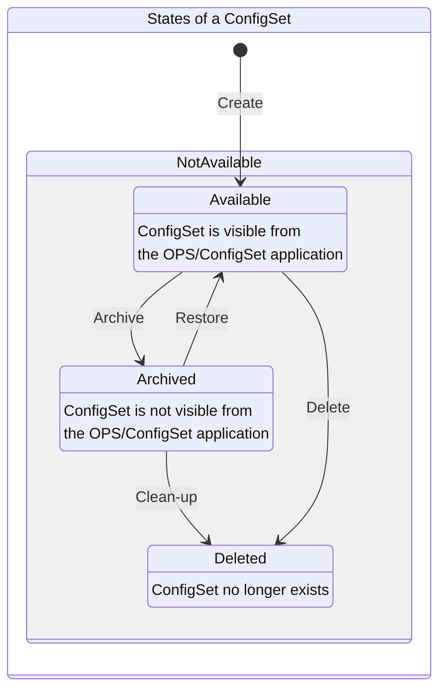

I want to test whether / how I can generate the model below with a "text to model" tool where the source model is in text form & change tracked by GitHub as the rest of the spec (so that you see who has done what change when).


Here the source model as example (out of the spec here [Feature #26 - Archive UI update (in ConfigSet)_New.md](https://github.com/DanielLH-sg/NO-Requirements/blob/main/Feature%20%2326%20-%20Archive%20UI%20update%20(in%20ConfigSet)_New.md)


Here a renderer: [editor.plantuml.com](https://editor.plantuml.com/uml/)
Here the source plantuml script:

```
@startuml
hide empty description
state "States of a ConfigSet" as ConfigSetStates
state ConfigSetStates {
[*] -> Available: Create
Available : ConfigSet is visible from \nthe OPS/ConfigSet application

state NotAvailable {
  Archived: ConfigSet is not visible from \nthe OPS/ConfigSet application
	Available --> Archived : Archive     .
	Archived --> Available :  Restore 
	Deleted: ConfigSet no longer exists
	Archived  -> Deleted : Clean-up
	Available --> Deleted : Delete 
}
@enduml
```

Mermaid

I've asked CoPilot: _"Translate the plantuml state diagram below into mermaid for usage in GitHub"_
Here CoPilot's graphical result:


CoPilot's Mermaid code:
'''
stateDiagram-v2
  hide empty description

  state "States of a ConfigSet" as ConfigSetStates {
    [*] --> Available : Create

    state "Available" as Available
    Available : ConfigSet is visible from\n the OPS/ConfigSet application

    state "NotAvailable" as NotAvailable {
      state "Archived" as Archived
      Archived : ConfigSet is not visible from\n the OPS/ConfigSet application

      state "Deleted" as Deleted
      Deleted : ConfigSet no longer exists

      Available --> Archived : Archive
      Archived --> Available : Restore
      Archived --> Deleted : Clean-up
      Available --> Deleted : Delete
    }
  }
'''  

Integration in GitHub's MD:




Rework to make it more biutiful:
My attempt to draw left to right have failed. I do not like it. 


